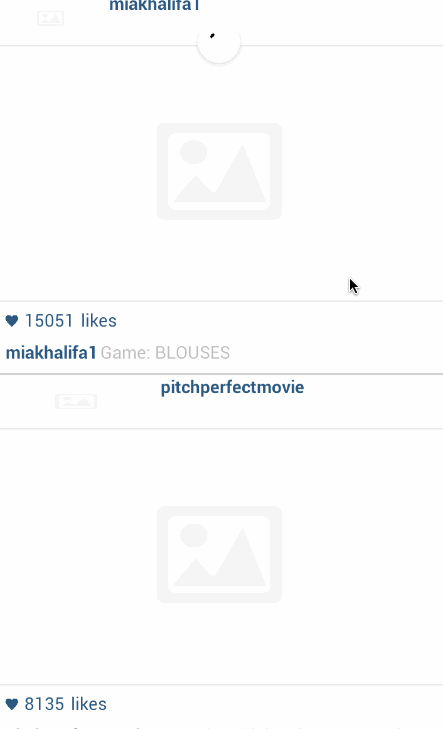

# [Android Bootcamp] Project 1

This is an Android demo application for viewing popular instagram photos.

Time spent: 2 hours spent in total

Completed user stories:

 * [x] Required: User can scroll through current popular photos from Instagram
 * [x] Required: For each photo displayed, user can see Graphic, Caption, Username
 * [x] Optional: Add pull-to-refresh for popular stream with SwipeRefreshLayout
 * [ ] Optional: Show latest comment for each photo (bonus: show last 2 comments)
 * [-] Optional: Display each photo with the same style and proportions as the real Instagram (see screens below)
 * [x] Optional: Display each user profile image using a RoundedImageView
 * [x] Optional: Display a nice default placeholder graphic for each image during loading (read more about Picasso)
 * [ ] Optional: Improve the user interface through styling and coloring
 * [ ] Optional: Allow user to view all comments for an image within a separate activity or dialog fragment
 * [ ] Optional: Allow video posts to be played in full-screen using the VideoView
 

Walkthrough of user stories:

GIF created with [LiceCap](http://www.cockos.com/licecap/).